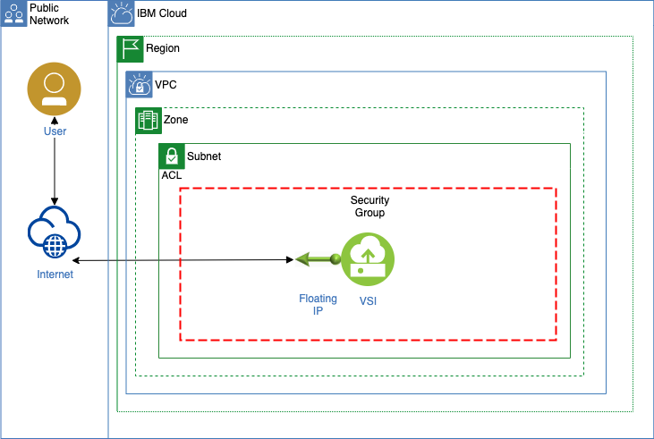

# Create a Virtual Private Cloud (VPC), Virtual Server Instance (VSI) on IBM Cloud with Terraform

This is a “simple” cheat sheet, how to create a single virtual server instance (VSI) in the virtual private cloud (VPC) infrastructure on IBM Cloud using Terraform.

“Terraform is to write infrastructure as code using declarative configuration files. HashiCorp Configuration Language (HCL) allows for concise descriptions of resources using blocks, arguments, and expressions.” resource Terraform.

There is an awesome documentation on IBM Cloud to do this:

Install terraform
Install IBM Cloud Terraform plugin
Provisioning an IBM Cloud virtual server for VPC
That blog post reuses a lot of the content in the IBM Cloud documentation. You need to install Terraform and and clone the example GitHub project as your example terraform project folder.

Architecture
The diagram shows the target architecture for this cheat sheet. We will create:

one virtual private cloud (VPC)
one virtual server instance (VSI)
one security group with a security group access control rule
one subnet
one floating IP (to access the virtual server instance)

Using Terraform
In that example we use the four usual major steps for working with Terraform and we will automate them with our bash script.

Init
Initialize Terraform to access IBM Cloud
Plan
Generate a Terraform execution plan for the VPC infrastructure resources on IBM Cloud
Apply
Apply the execution plan to create the VPC infrastructure resources
Destroy
Clean up the VPC infrastructure resources
Be aware that it worked when I created that blog post, but there can be changes in the Terraform models made by IBM or other providers. 

Please verify the latest IBM Cloud modules in the Terraform Registry for the IBM Cloud provider.

Step 1: Install Terraform, Golang and on you local MacOS
Just follow the steps in the IBM Cloud documentation to install Terraform.

Step 2: Clone the GitHub Project¶
1
2
git clone https://github.com/thomassuedbroecker/terraform-vpc-project-example.git
cd terraform-vpc-project-example
The example GitHub project contains two Terraform files and one bash script that we will use to automate the Terraform CLI and IBM Cloud CLI commands.

provider.tf
That file contains all we need in our example. The terraform cloud provider configurations and the VPC and VSI configuration definition for the IBM Cloud.

terraform.tfvars
This file contains variables and values we use in the provider.tf file.

Step 3: Verify the required_providers definition in the provider.tf file
First let us take a look into the definition for our IBM Cloud provider. When we run the terraform init command automatically the needed provider will be installed into our project folder.

Step 4: Verify the variables definition in the terraform.tfvars file and provider.tf Terraform configuration file
Definition of the variables for the the *.tf configuration file
In our case we upload the SSH Key with the IBM Cloud infrastructure CLI

############################
# Variables
############################
 
variable "ibmcloud_api_key" {}
variable "iaas_classic_username" {}
variable "iaas_classic_api_key" {}
variable "region" {}
variable "my_ssh_key_name" {}
Step 5: Define internal variables in the *.tf Terraform configuration file
locals: Use this block to specify variables that you want to use multiple times throughout this configuration file. Resources IBM Cloud Documentation. Resource IBM Cloud Documentation

# Existing SSH key can be provided
data "ibm_is_ssh_key" "ssh_key_id" {
   name = var.my_ssh_key_name
}
Step 6: Define the Virtual Private Cloud configuration
resource: Every resource block specifies the IBM Cloud resource that you want to provision. To find more information about supported configurations for each resource, see the IBM Cloud provider plug-in reference. Resource IBM Cloud Documentation

Step 7: Define the Virtual Server Instance configuration
This part for the configuration in the Terraform file contains all relevant information for the Virtual Server Instance.

Image
SSH Key
Network
Floating IP
data: Use this block to retrieve information for an existing resource in your IBM Cloud account.
output: This block specifies commands that you want to run after your resources are provisioned.
Resource IBM Cloud Documentation

Automation with a bash script
The bash script create_vpc_with_terraform.sh automates all steps with Terraform and some of the configuration with the IBM Cloud CLI.

The major sections are:

Logon with IBM Cloud CLI
Upload an existing SSH Key to VPC on IBM Cloud
Init with Terraform CLI
Plan with Terraform CLI
Apply with Terraform CLI
Verify instances with IBM Cloud CLI
Verify instances with IBM Cloud console
Destroy with Terraform CLI
1
bash create_vpc_with_terraform.sh

Summary
The IBM Cloud documentation is very helpful and very detailed. That “simple” cheat sheet just contains the major simplified steps in a row to create a VPC and VSI and it includes a GitHub project as a simple starting point.

Validation pat:-
$ terraform plan
data.ibm_is_image.centos: Reading...
data.ibm_is_ssh_key.ssh_key_id: Reading...
data.ibm_is_image.centos: Read complete after 4s [id=r006-e0039ab2-fcc8-11e9-8a36-6ffb6501dd33]
data.ibm_is_ssh_key.ssh_key_id: Read complete after 4s [id=r006-dd896e8a-051a-485f-9bfc-547b2c4dc2cd]

Terraform used the selected providers to generate the following execution plan. Resource actions are indicated with the following symbols:
  + create

Terraform will perform the following actions:

  # ibm_is_floating_ip.fip1 will be created
  + resource "ibm_is_floating_ip" "fip1" {
      + access_tags             = (known after apply)
      + address                 = (known after apply)
      + crn                     = (known after apply)
      + id                      = (known after apply)
      + name                    = "example-fip1"
      + resource_controller_url = (known after apply)
      + resource_crn            = (known after apply)
      + resource_group          = (known after apply)
      + resource_group_name     = (known after apply)
      + resource_name           = (known after apply)
      + resource_status         = (known after apply)
      + status                  = (known after apply)
      + tags                    = (known after apply)
      + target                  = (known after apply)
      + target_list             = (known after apply)
      + zone                    = (known after apply)
    }

  # ibm_is_instance.vsi1 will be created
  + resource "ibm_is_instance" "vsi1" {
      + access_tags                       = (known after apply)
      + availability_policy_host_failure  = (known after apply)
      + bandwidth                         = (known after apply)
      + crn                               = (known after apply)
      + default_trusted_profile_auto_link = (known after apply)
      + disks                             = (known after apply)
      + force_action                      = false
      + gpu                               = (known after apply)
      + id                                = (known after apply)
      + image                             = "r006-e0039ab2-fcc8-11e9-8a36-6ffb6501dd33"
      + keys                              = [
          + "r006-dd896e8a-051a-485f-9bfc-547b2c4dc2cd",
        ]
      + lifecycle_reasons                 = (known after apply)
      + lifecycle_state                   = (known after apply)
      + memory                            = (known after apply)
      + metadata_service_enabled          = (known after apply)
      + name                              = "example-vsi1"
      + placement_target                  = (known after apply)
      + profile                           = "cx2-2x4"
      + resource_controller_url           = (known after apply)
      + resource_crn                      = (known after apply)
      + resource_group                    = (known after apply)
      + resource_group_name               = (known after apply)
      + resource_name                     = (known after apply)
      + resource_status                   = (known after apply)
      + status                            = (known after apply)
      + status_reasons                    = (known after apply)
      + tags                              = (known after apply)
      + total_network_bandwidth           = (known after apply)
      + total_volume_bandwidth            = (known after apply)
      + vcpu                              = (known after apply)
      + volume_attachments                = (known after apply)
      + vpc                               = (known after apply)
      + wait_before_delete                = true
      + zone                              = "us-south-1"

      + primary_network_interface {
          + allow_ip_spoofing    = false
          + id                   = (known after apply)
          + name                 = (known after apply)
          + port_speed           = (known after apply)
          + primary_ipv4_address = (known after apply)
          + security_groups      = (known after apply)
          + subnet               = (known after apply)
        }
    }

  # ibm_is_security_group.sg1 will be created
  + resource "ibm_is_security_group" "sg1" {
      + access_tags             = (known after apply)
      + crn                     = (known after apply)
      + id                      = (known after apply)
      + name                    = "example-sg1"
      + resource_controller_url = (known after apply)
      + resource_crn            = (known after apply)
      + resource_group          = (known after apply)
      + resource_group_name     = (known after apply)
      + resource_name           = (known after apply)
      + rules                   = (known after apply)
      + tags                    = (known after apply)
      + vpc                     = (known after apply)
    }

  # ibm_is_security_group_rule.example-ingress_ssh_all will be created
  + resource "ibm_is_security_group_rule" "example-ingress_ssh_all" {
      + direction   = "inbound"
      + group       = (known after apply)
      + id          = (known after apply)
      + ip_version  = "ipv4"
      + protocol    = (known after apply)
      + related_crn = (known after apply)
      + remote      = "0.0.0.0/0"
      + rule_id     = (known after apply)

      + tcp {
          + port_max = 22
          + port_min = 22
        }
    }

  # ibm_is_subnet.subnet1 will be created
  + resource "ibm_is_subnet" "subnet1" {
      + access_tags                  = (known after apply)
      + available_ipv4_address_count = (known after apply)
      + crn                          = (known after apply)
      + id                           = (known after apply)
      + ip_version                   = "ipv4"
      + ipv4_cidr_block              = (known after apply)
      + name                         = "example-subnet1"
      + network_acl                  = (known after apply)
      + public_gateway               = (known after apply)
      + resource_controller_url      = (known after apply)
      + resource_crn                 = (known after apply)
      + resource_group               = (known after apply)
      + resource_group_name          = (known after apply)
      + resource_name                = (known after apply)
      + resource_status              = (known after apply)
      + routing_table                = (known after apply)
      + status                       = (known after apply)
      + tags                         = (known after apply)
      + total_ipv4_address_count     = 256
      + vpc                          = (known after apply)
      + zone                         = "us-south-1"
    }

  # ibm_is_vpc.vpc-instance will be created
  + resource "ibm_is_vpc" "vpc-instance" {
      + access_tags                 = (known after apply)
      + address_prefix_management   = "auto"
      + classic_access              = false
      + crn                         = (known after apply)
      + cse_source_addresses        = (known after apply)
      + default_network_acl         = (known after apply)
      + default_network_acl_crn     = (known after apply)
      + default_network_acl_name    = (known after apply)
      + default_routing_table       = (known after apply)
      + default_routing_table_name  = (known after apply)
      + default_security_group      = (known after apply)
      + default_security_group_crn  = (known after apply)
      + default_security_group_name = (known after apply)
      + id                          = (known after apply)
      + name                        = "example-vpc"
      + resource_controller_url     = (known after apply)
      + resource_crn                = (known after apply)
      + resource_group              = (known after apply)
      + resource_group_name         = (known after apply)
      + resource_name               = (known after apply)
      + resource_status             = (known after apply)
      + security_group              = (known after apply)
      + status                      = (known after apply)
      + subnets                     = (known after apply)
      + tags                        = (known after apply)
    }

Plan: 6 to add, 0 to change, 0 to destroy.

───────────────────────────────────────────────────────────────────────────────────────────────────────────────────────────────────────────────────────────────────────────

Note: You didn't use the -out option to save this plan, so Terraform can't guarantee to take exactly these actions if you run "terraform apply" now.

Ajith Jesudasan@DESKTOP-556QOFO MINGW64 ~/Desktop/Technical Documents/Terraform/IBM_Cloud_Terraform/vpc-vsi-deployment (main)
$ terraform apply
data.ibm_is_image.centos: Reading...
data.ibm_is_ssh_key.ssh_key_id: Reading...
data.ibm_is_image.centos: Read complete after 3s [id=r006-e0039ab2-fcc8-11e9-8a36-6ffb6501dd33]
data.ibm_is_ssh_key.ssh_key_id: Read complete after 4s [id=r006-dd896e8a-051a-485f-9bfc-547b2c4dc2cd]

Terraform used the selected providers to generate the following execution plan. Resource actions are indicated with the following symbols:
  + create

Terraform will perform the following actions:

  # ibm_is_floating_ip.fip1 will be created
  + resource "ibm_is_floating_ip" "fip1" {
      + access_tags             = (known after apply)
      + address                 = (known after apply)
      + crn                     = (known after apply)
      + id                      = (known after apply)
      + name                    = "example-fip1"
      + resource_controller_url = (known after apply)
      + resource_crn            = (known after apply)
      + resource_group          = (known after apply)
      + resource_group_name     = (known after apply)
      + resource_name           = (known after apply)
      + resource_status         = (known after apply)
      + status                  = (known after apply)
      + tags                    = (known after apply)
      + target                  = (known after apply)
      + target_list             = (known after apply)
      + zone                    = (known after apply)
    }

  # ibm_is_instance.vsi1 will be created
  + resource "ibm_is_instance" "vsi1" {
      + access_tags                       = (known after apply)
      + availability_policy_host_failure  = (known after apply)
      + bandwidth                         = (known after apply)
      + crn                               = (known after apply)
      + default_trusted_profile_auto_link = (known after apply)
      + disks                             = (known after apply)
      + force_action                      = false
      + gpu                               = (known after apply)
      + id                                = (known after apply)
      + image                             = "r006-e0039ab2-fcc8-11e9-8a36-6ffb6501dd33"
      + keys                              = [
          + "r006-dd896e8a-051a-485f-9bfc-547b2c4dc2cd",
        ]
      + lifecycle_reasons                 = (known after apply)
      + lifecycle_state                   = (known after apply)
      + memory                            = (known after apply)
      + metadata_service_enabled          = (known after apply)
      + name                              = "example-vsi1"
      + placement_target                  = (known after apply)
      + profile                           = "cx2-2x4"
      + resource_controller_url           = (known after apply)
      + resource_crn                      = (known after apply)
      + resource_group                    = (known after apply)
      + resource_group_name               = (known after apply)
      + resource_name                     = (known after apply)
      + resource_status                   = (known after apply)
      + status                            = (known after apply)
      + status_reasons                    = (known after apply)
      + tags                              = (known after apply)
      + total_network_bandwidth           = (known after apply)
      + total_volume_bandwidth            = (known after apply)
      + vcpu                              = (known after apply)
      + volume_attachments                = (known after apply)
      + vpc                               = (known after apply)
      + wait_before_delete                = true
      + zone                              = "us-south-1"

      + primary_network_interface {
          + allow_ip_spoofing    = false
          + id                   = (known after apply)
          + name                 = (known after apply)
          + port_speed           = (known after apply)
          + primary_ipv4_address = (known after apply)
          + security_groups      = (known after apply)
          + subnet               = (known after apply)
        }
    }

  # ibm_is_security_group.sg1 will be created
  + resource "ibm_is_security_group" "sg1" {
      + access_tags             = (known after apply)
      + crn                     = (known after apply)
      + id                      = (known after apply)
      + name                    = "example-sg1"
      + resource_controller_url = (known after apply)
      + resource_crn            = (known after apply)
      + resource_group          = (known after apply)
      + resource_group_name     = (known after apply)
      + resource_name           = (known after apply)
      + rules                   = (known after apply)
      + tags                    = (known after apply)
      + vpc                     = (known after apply)
    }

  # ibm_is_security_group_rule.example-ingress_ssh_all will be created
  + resource "ibm_is_security_group_rule" "example-ingress_ssh_all" {
      + direction   = "inbound"
      + group       = (known after apply)
      + id          = (known after apply)
      + ip_version  = "ipv4"
      + protocol    = (known after apply)
      + related_crn = (known after apply)
      + remote      = "0.0.0.0/0"
      + rule_id     = (known after apply)

      + tcp {
          + port_max = 22
          + port_min = 22
        }
    }

  # ibm_is_subnet.subnet1 will be created
  + resource "ibm_is_subnet" "subnet1" {
      + access_tags                  = (known after apply)
      + available_ipv4_address_count = (known after apply)
      + crn                          = (known after apply)
      + id                           = (known after apply)
      + ip_version                   = "ipv4"
      + ipv4_cidr_block              = (known after apply)
      + name                         = "example-subnet1"
      + network_acl                  = (known after apply)
      + public_gateway               = (known after apply)
      + resource_controller_url      = (known after apply)
      + resource_crn                 = (known after apply)
      + resource_group               = (known after apply)
      + resource_group_name          = (known after apply)
      + resource_name                = (known after apply)
      + resource_status              = (known after apply)
      + routing_table                = (known after apply)
      + status                       = (known after apply)
      + tags                         = (known after apply)
      + total_ipv4_address_count     = 256
      + vpc                          = (known after apply)
      + zone                         = "us-south-1"
    }

  # ibm_is_vpc.vpc-instance will be created
  + resource "ibm_is_vpc" "vpc-instance" {
      + access_tags                 = (known after apply)
      + address_prefix_management   = "auto"
      + classic_access              = false
      + crn                         = (known after apply)
      + cse_source_addresses        = (known after apply)
      + default_network_acl         = (known after apply)
      + default_network_acl_crn     = (known after apply)
      + default_network_acl_name    = (known after apply)
      + default_routing_table       = (known after apply)
      + default_routing_table_name  = (known after apply)
      + default_security_group      = (known after apply)
      + default_security_group_crn  = (known after apply)
      + default_security_group_name = (known after apply)
      + id                          = (known after apply)
      + name                        = "example-vpc"
      + resource_controller_url     = (known after apply)
      + resource_crn                = (known after apply)
      + resource_group              = (known after apply)
      + resource_group_name         = (known after apply)
      + resource_name               = (known after apply)
      + resource_status             = (known after apply)
      + security_group              = (known after apply)
      + status                      = (known after apply)
      + subnets                     = (known after apply)
      + tags                        = (known after apply)
    }

Plan: 6 to add, 0 to change, 0 to destroy.

Do you want to perform these actions?
  Terraform will perform the actions described above.
  Only 'yes' will be accepted to approve.

  Enter a value: yes

ibm_is_vpc.vpc-instance: Creating...
ibm_is_vpc.vpc-instance: Still creating... [10s elapsed]
ibm_is_vpc.vpc-instance: Creation complete after 19s [id=r006-f24e6473-09f9-47a9-8b44-e20f4d259936]
ibm_is_security_group.sg1: Creating...
ibm_is_subnet.subnet1: Creating...
ibm_is_security_group.sg1: Creation complete after 3s [id=r006-a2ef7a50-eaef-4f6b-b1b7-7479c962a298]
ibm_is_security_group_rule.example-ingress_ssh_all: Creating...
ibm_is_security_group_rule.example-ingress_ssh_all: Creation complete after 3s [id=r006-a2ef7a50-eaef-4f6b-b1b7-7479c962a298.r006-a0d71ac6-0673-40e2-8c61-0e62d5f73f87]
ibm_is_subnet.subnet1: Still creating... [10s elapsed]
ibm_is_subnet.subnet1: Creation complete after 15s [id=0717-0342ee1a-6b75-47fd-8407-17dec90d6d5d]
ibm_is_instance.vsi1: Creating...
ibm_is_instance.vsi1: Still creating... [10s elapsed]
ibm_is_instance.vsi1: Still creating... [20s elapsed]
ibm_is_instance.vsi1: Creation complete after 27s [id=0717_61fddc02-1fea-43f0-9ebc-e2bff2bd13b2]
ibm_is_floating_ip.fip1: Creating...
ibm_is_floating_ip.fip1: Still creating... [10s elapsed]
ibm_is_floating_ip.fip1: Creation complete after 13s [id=r006-8e537a14-f933-4596-9c62-ddee00424c09]

Apply complete! Resources: 6 added, 0 changed, 0 destroyed.

Ajith Jesudasan@DESKTOP-556QOFO MINGW64 ~/Desktop/Technical Documents/Terraform/IBM_Cloud_Terraform/vpc-vsi-deployment (main)
$ ibmcloud is vpcs
Listing vpcs in all resource groups and region us-south under account Ajith Jesudasan's Account as user ajith.devopspractice@gmail.com...
ID                                          Name          Status      Classic access   Default network ACL              Default security group                 Resource grou
p
r006-f24e6473-09f9-47a9-8b44-e20f4d259936   example-vpc   available   false            esquire-android-salon-national   unnerving-chatting-partridge-obscure   Default

Ajith Jesudasan@DESKTOP-556QOFO MINGW64 ~/Desktop/Technical Documents/Terraform/IBM_Cloud_Terraform/vpc-vsi-deployment (main)
$ ibmcloud is subnets
Listing subnets in all resource groups and region us-south under account Ajith Jesudasan's Account as user ajith.devopspractice@gmail.com...
ID                                          Name              Status      Subnet CIDR     Addresses   ACL                              Public Gateway   VPC           Zone
       Resource group
0717-0342ee1a-6b75-47fd-8407-17dec90d6d5d   example-subnet1   available   10.240.0.0/24   250/256     esquire-android-salon-national   -                example-vpc   us-sou
th-1   Default

Ajith Jesudasan@DESKTOP-556QOFO MINGW64 ~/Desktop/Technical Documents/Terraform/IBM_Cloud_Terraform/vpc-vsi-deployment (main)
$ ibmcloud is security-groups
Listing security groups in all resource groups and region us-south under account Ajith Jesudasan's Account as user ajith.devopspractice@gmail.com...
ID                                          Name                                   Rules   Targets   VPC           Resource group
r006-a2ef7a50-eaef-4f6b-b1b7-7479c962a298   example-sg1                            1       1         example-vpc   Default
r006-e0463dae-073c-47d6-9949-44923fe620d8   unnerving-chatting-partridge-obscure   2       0         example-vpc   Default

Ajith Jesudasan@DESKTOP-556QOFO MINGW64 ~/Desktop/Technical Documents/Terraform/IBM_Cloud_Terraform/vpc-vsi-deployment (main)
$ ibmcloud is floating-ips
Listing floating IPs in all resource groups and region us-south under account Ajith Jesudasan's Account as user ajith.devopspractice@gmail.com...
ID                                          Address          Name           Status      Target                                         Target type         Zone         Reso
urce group
r006-8e537a14-f933-4596-9c62-ddee00424c09   52.116.141.187   example-fip1   available   example-vsi1(urban-greater-resisting-spiffy)   network_interface   us-south-1   Defa
ult

Ajith Jesudasan@DESKTOP-556QOFO MINGW64 ~/Desktop/Technical Documents/Terraform/IBM_Cloud_Terraform/vpc-vsi-deployment (main)
$ ibmcloud is keys
Listing keys in all resource groups and region us-south under account Ajith Jesudasan's Account as user ajith.devopspractice@gmail.com...
ID                                          Name              Type   Length   FingerPrint          Resource group
r006-dd896e8a-051a-485f-9bfc-547b2c4dc2cd   vpcvsisamplekey   rsa    4096     Z+7mz0QbIKXZtGbH..   Default

$ terraform destroy
data.ibm_is_image.centos: Reading...
data.ibm_is_ssh_key.ssh_key_id: Reading...
ibm_is_vpc.vpc-instance: Refreshing state... [id=r006-f24e6473-09f9-47a9-8b44-e20f4d259936]
data.ibm_is_ssh_key.ssh_key_id: Read complete after 4s [id=r006-dd896e8a-051a-485f-9bfc-547b2c4dc2cd]
data.ibm_is_image.centos: Read complete after 4s [id=r006-e0039ab2-fcc8-11e9-8a36-6ffb6501dd33]
ibm_is_security_group.sg1: Refreshing state... [id=r006-a2ef7a50-eaef-4f6b-b1b7-7479c962a298]
ibm_is_subnet.subnet1: Refreshing state... [id=0717-0342ee1a-6b75-47fd-8407-17dec90d6d5d]
ibm_is_security_group_rule.example-ingress_ssh_all: Refreshing state... [id=r006-a2ef7a50-eaef-4f6b-b1b7-7479c962a298.r006-a0d71ac6-0673-40e2-8c61-0e62d5f73f87]
ibm_is_instance.vsi1: Refreshing state... [id=0717_61fddc02-1fea-43f0-9ebc-e2bff2bd13b2]
ibm_is_floating_ip.fip1: Refreshing state... [id=r006-8e537a14-f933-4596-9c62-ddee00424c09]

Terraform used the selected providers to generate the following execution plan. Resource actions are indicated with the following symbols:
  - destroy

Terraform will perform the following actions:

  # ibm_is_floating_ip.fip1 will be destroyed
  - resource "ibm_is_floating_ip" "fip1" {
      - access_tags             = [] -> null
      - address                 = "52.116.141.187" -> null
      - crn                     = "crn:v1:bluemix:public:is:us-south-1:a/f10e16e59f134b55a854654d27a6a6ab::floating-ip:r006-8e537a14-f933-4596-9c62-ddee00424c09" -> null
      - id                      = "r006-8e537a14-f933-4596-9c62-ddee00424c09" -> null
      - name                    = "example-fip1" -> null
      - resource_controller_url = "https://cloud.ibm.com/vpc-ext/network/floatingIPs" -> null
      - resource_crn            = "crn:v1:bluemix:public:is:us-south-1:a/f10e16e59f134b55a854654d27a6a6ab::floating-ip:r006-8e537a14-f933-4596-9c62-ddee00424c09" -> null
      - resource_group          = "074873e504114510a5afa01838a3c58b" -> null
      - resource_group_name     = "Default" -> null
      - resource_name           = "example-fip1" -> null
      - resource_status         = "available" -> null
      - status                  = "available" -> null
      - tags                    = [] -> null
      - target                  = "0717-83154bae-aad5-4c7c-9775-ac22dddfaf44" -> null
      - target_list             = [
          - {
              - crn           = ""
              - deleted       = []
              - href          = "https://us-south.iaas.cloud.ibm.com/v1/instances/0717_61fddc02-1fea-43f0-9ebc-e2bff2bd13b2/network_interfaces/0717-83154bae-aad5-4c7c-9775-
ac22dddfaf44"
              - id            = "0717-83154bae-aad5-4c7c-9775-ac22dddfaf44"
              - name          = "urban-greater-resisting-spiffy"
              - primary_ip    = [
                  - {
                      - address       = "10.240.0.4"
                      - href          = "https://us-south.iaas.cloud.ibm.com/v1/subnets/0717-0342ee1a-6b75-47fd-8407-17dec90d6d5d/reserved_ips/0717-1c5453e9-4f2e-40af-aa36-
170569a7e7e4"
                      - name          = "satiable-bauble-pager-corse"
                      - reserved_ip   = "0717-1c5453e9-4f2e-40af-aa36-170569a7e7e4"
                      - resource_type = "subnet_reserved_ip"
                    },
                ]
              - resource_type = "network_interface"
            },
        ] -> null
      - zone                    = "us-south-1" -> null
    }

  # ibm_is_instance.vsi1 will be destroyed
  - resource "ibm_is_instance" "vsi1" {
      - access_tags                      = [] -> null
      - availability_policy_host_failure = "restart" -> null
      - bandwidth                        = 4000 -> null
      - crn                              = "crn:v1:bluemix:public:is:us-south-1:a/f10e16e59f134b55a854654d27a6a6ab::instance:0717_61fddc02-1fea-43f0-9ebc-e2bff2bd13b2" -> n
ull
      - disks                            = [] -> null
      - force_action                     = false -> null
      - gpu                              = [] -> null
      - id                               = "0717_61fddc02-1fea-43f0-9ebc-e2bff2bd13b2" -> null
      - image                            = "r006-e0039ab2-fcc8-11e9-8a36-6ffb6501dd33" -> null
      - keys                             = [
          - "r006-dd896e8a-051a-485f-9bfc-547b2c4dc2cd",
        ] -> null
      - lifecycle_reasons                = [] -> null
      - lifecycle_state                  = "stable" -> null
      - memory                           = 4 -> null
      - metadata_service_enabled         = false -> null
      - name                             = "example-vsi1" -> null
      - placement_target                 = [] -> null
      - profile                          = "cx2-2x4" -> null
      - resource_controller_url          = "https://cloud.ibm.com/vpc-ext/compute/vs" -> null
      - resource_crn                     = "crn:v1:bluemix:public:is:us-south-1:a/f10e16e59f134b55a854654d27a6a6ab::instance:0717_61fddc02-1fea-43f0-9ebc-e2bff2bd13b2" -> n
ull
      - resource_group                   = "074873e504114510a5afa01838a3c58b" -> null
      - resource_group_name              = "Default" -> null
      - resource_name                    = "example-vsi1" -> null
      - resource_status                  = "running" -> null
      - status                           = "running" -> null
      - status_reasons                   = [] -> null
      - tags                             = [] -> null
      - total_network_bandwidth          = 3000 -> null
      - total_volume_bandwidth           = 1000 -> null
      - vcpu                             = [
          - {
              - architecture = "amd64"
              - count        = 2
              - manufacturer = "intel"
            },
        ] -> null
      - volume_attachments               = [
          - {
              - id          = "0717-7609ef47-f96d-4f16-be90-f03808d10a4b"
              - name        = "destiny-twig-kerchief-pug"
              - volume_crn  = "crn:v1:bluemix:public:is:us-south-1:a/f10e16e59f134b55a854654d27a6a6ab::volume:r006-83f3860b-3548-4cee-84f8-f5c9eb28be41"
              - volume_id   = "r006-83f3860b-3548-4cee-84f8-f5c9eb28be41"
              - volume_name = "speech-scooter-projector-quote"
            },
        ] -> null
      - vpc                              = "r006-f24e6473-09f9-47a9-8b44-e20f4d259936" -> null
      - wait_before_delete               = true -> null
      - zone                             = "us-south-1" -> null

      - boot_volume {
          - auto_delete_volume = true -> null
          - iops               = 3000 -> null
          - name               = "speech-scooter-projector-quote" -> null
          - profile            = "general-purpose" -> null
          - size               = 100 -> null
          - tags               = [] -> null
          - volume_id          = "r006-83f3860b-3548-4cee-84f8-f5c9eb28be41" -> null
        }

      - metadata_service {
          - enabled            = false -> null
          - protocol           = "http" -> null
          - response_hop_limit = 1 -> null
        }

      - primary_network_interface {
          - allow_ip_spoofing    = false -> null
          - id                   = "0717-83154bae-aad5-4c7c-9775-ac22dddfaf44" -> null
          - name                 = "urban-greater-resisting-spiffy" -> null
          - port_speed           = 3000 -> null
          - primary_ipv4_address = "10.240.0.4" -> null
          - security_groups      = [
              - "r006-a2ef7a50-eaef-4f6b-b1b7-7479c962a298",
            ] -> null
          - subnet               = "0717-0342ee1a-6b75-47fd-8407-17dec90d6d5d" -> null

          - primary_ip {
              - address       = "10.240.0.4" -> null
              - auto_delete   = true -> null
              - href          = "https://us-south.iaas.cloud.ibm.com/v1/subnets/0717-0342ee1a-6b75-47fd-8407-17dec90d6d5d/reserved_ips/0717-1c5453e9-4f2e-40af-aa36-170569a7
e7e4" -> null
              - name          = "satiable-bauble-pager-corse" -> null
              - reserved_ip   = "0717-1c5453e9-4f2e-40af-aa36-170569a7e7e4" -> null
              - resource_type = "subnet_reserved_ip" -> null
            }
        }
    }

  # ibm_is_security_group.sg1 will be destroyed
  - resource "ibm_is_security_group" "sg1" {
      - access_tags             = [] -> null
      - crn                     = "crn:v1:bluemix:public:is:us-south:a/f10e16e59f134b55a854654d27a6a6ab::security-group:r006-a2ef7a50-eaef-4f6b-b1b7-7479c962a298" -> null
      - id                      = "r006-a2ef7a50-eaef-4f6b-b1b7-7479c962a298" -> null
      - name                    = "example-sg1" -> null
      - resource_controller_url = "https://cloud.ibm.com/vpc-ext/network/securityGroups" -> null
      - resource_crn            = "crn:v1:bluemix:public:is:us-south:a/f10e16e59f134b55a854654d27a6a6ab::security-group:r006-a2ef7a50-eaef-4f6b-b1b7-7479c962a298" -> null
      - resource_group          = "074873e504114510a5afa01838a3c58b" -> null
      - resource_group_name     = "Default" -> null
      - resource_name           = "example-sg1" -> null
      - rules                   = [
          - {
              - code       = 0
              - direction  = "inbound"
              - ip_version = "ipv4"
              - port_max   = 22
              - port_min   = 22
              - protocol   = "tcp"
              - remote     = "0.0.0.0/0"
              - type       = 0
            },
        ] -> null
      - tags                    = [] -> null
      - vpc                     = "r006-f24e6473-09f9-47a9-8b44-e20f4d259936" -> null
    }

  # ibm_is_security_group_rule.example-ingress_ssh_all will be destroyed
  - resource "ibm_is_security_group_rule" "example-ingress_ssh_all" {
      - direction   = "inbound" -> null
      - group       = "r006-a2ef7a50-eaef-4f6b-b1b7-7479c962a298" -> null
      - id          = "r006-a2ef7a50-eaef-4f6b-b1b7-7479c962a298.r006-a0d71ac6-0673-40e2-8c61-0e62d5f73f87" -> null
      - ip_version  = "ipv4" -> null
      - protocol    = "tcp" -> null
      - related_crn = "crn:v1:bluemix:public:is:us-south:a/f10e16e59f134b55a854654d27a6a6ab::security-group:r006-a2ef7a50-eaef-4f6b-b1b7-7479c962a298" -> null
      - remote      = "0.0.0.0/0" -> null
      - rule_id     = "r006-a0d71ac6-0673-40e2-8c61-0e62d5f73f87" -> null

      - tcp {
          - port_max = 22 -> null
          - port_min = 22 -> null
        }
    }

  # ibm_is_subnet.subnet1 will be destroyed
  - resource "ibm_is_subnet" "subnet1" {
      - access_tags                  = [] -> null
      - available_ipv4_address_count = 250 -> null
      - crn                          = "crn:v1:bluemix:public:is:us-south-1:a/f10e16e59f134b55a854654d27a6a6ab::subnet:0717-0342ee1a-6b75-47fd-8407-17dec90d6d5d" -> null
      - id                           = "0717-0342ee1a-6b75-47fd-8407-17dec90d6d5d" -> null
      - ip_version                   = "ipv4" -> null
      - ipv4_cidr_block              = "10.240.0.0/24" -> null
      - name                         = "example-subnet1" -> null
      - network_acl                  = "r006-e016f965-6008-4698-9aed-7d87faa82ecf" -> null
      - resource_controller_url      = "https://cloud.ibm.com/vpc-ext/network/subnets" -> null
      - resource_crn                 = "crn:v1:bluemix:public:is:us-south-1:a/f10e16e59f134b55a854654d27a6a6ab::subnet:0717-0342ee1a-6b75-47fd-8407-17dec90d6d5d" -> null
      - resource_group               = "074873e504114510a5afa01838a3c58b" -> null
      - resource_group_name          = "Default" -> null
      - resource_name                = "example-subnet1" -> null
      - resource_status              = "available" -> null
      - routing_table                = "r006-73491fc4-a1e4-4de0-844c-67f920164f89" -> null
      - status                       = "available" -> null
      - tags                         = [] -> null
      - total_ipv4_address_count     = 256 -> null
      - vpc                          = "r006-f24e6473-09f9-47a9-8b44-e20f4d259936" -> null
      - zone                         = "us-south-1" -> null
    }

  # ibm_is_vpc.vpc-instance will be destroyed
  - resource "ibm_is_vpc" "vpc-instance" {
      - access_tags                 = [] -> null
      - address_prefix_management   = "auto" -> null
      - classic_access              = false -> null
      - crn                         = "crn:v1:bluemix:public:is:us-south:a/f10e16e59f134b55a854654d27a6a6ab::vpc:r006-f24e6473-09f9-47a9-8b44-e20f4d259936" -> null
      - cse_source_addresses        = [
          - {
              - address   = "10.22.218.86"
              - zone_name = "us-south-1"
            },
          - {
              - address   = "10.22.225.227"
              - zone_name = "us-south-2"
            },
          - {
              - address   = "10.16.253.218"
              - zone_name = "us-south-3"
            },
        ] -> null
      - default_network_acl         = "r006-e016f965-6008-4698-9aed-7d87faa82ecf" -> null
      - default_network_acl_crn     = "crn:v1:bluemix:public:is:us-south:a/f10e16e59f134b55a854654d27a6a6ab::network-acl:r006-e016f965-6008-4698-9aed-7d87faa82ecf" -> null
      - default_network_acl_name    = "esquire-android-salon-national" -> null
      - default_routing_table       = "r006-73491fc4-a1e4-4de0-844c-67f920164f89" -> null
      - default_routing_table_name  = "brunt-almost-blot-stature" -> null
      - default_security_group      = "r006-e0463dae-073c-47d6-9949-44923fe620d8" -> null
      - default_security_group_crn  = "crn:v1:bluemix:public:is:us-south:a/f10e16e59f134b55a854654d27a6a6ab::security-group:r006-e0463dae-073c-47d6-9949-44923fe620d8" -> nu
ll
      - default_security_group_name = "unnerving-chatting-partridge-obscure" -> null
      - id                          = "r006-f24e6473-09f9-47a9-8b44-e20f4d259936" -> null
      - name                        = "example-vpc" -> null
      - resource_controller_url     = "https://cloud.ibm.com/vpc-ext/network/vpcs" -> null
      - resource_crn                = "crn:v1:bluemix:public:is:us-south:a/f10e16e59f134b55a854654d27a6a6ab::vpc:r006-f24e6473-09f9-47a9-8b44-e20f4d259936" -> null
      - resource_group              = "074873e504114510a5afa01838a3c58b" -> null
      - resource_group_name         = "Default" -> null
      - resource_name               = "example-vpc" -> null
      - resource_status             = "available" -> null
      - security_group              = [
          - {
              - group_id   = "r006-a2ef7a50-eaef-4f6b-b1b7-7479c962a298"
              - group_name = "example-sg1"
              - rules      = [
                  - {
                      - code       = 0
                      - direction  = "inbound"
                      - ip_version = "ipv4"
                      - port_max   = 22
                      - port_min   = 22
                      - protocol   = "tcp"
                      - remote     = "0.0.0.0/0"
                      - rule_id    = "r006-a0d71ac6-0673-40e2-8c61-0e62d5f73f87"
                      - type       = 0
                    },
                ]
            },
          - {
              - group_id   = "r006-e0463dae-073c-47d6-9949-44923fe620d8"
              - group_name = "unnerving-chatting-partridge-obscure"
              - rules      = [
                  - {
                      - code       = 0
                      - direction  = "outbound"
                      - ip_version = "ipv4"
                      - port_max   = 0
                      - port_min   = 0
                      - protocol   = "all"
                      - remote     = "0.0.0.0/0"
                      - rule_id    = "r006-69aeaf77-427d-40af-ae5c-9dea198ae9aa"
                      - type       = 0
                    },
                  - {
                      - code       = 0
                      - direction  = "inbound"
                      - ip_version = "ipv4"
                      - port_max   = 0
                      - port_min   = 0
                      - protocol   = "all"
                      - remote     = "r006-e0463dae-073c-47d6-9949-44923fe620d8"
                      - rule_id    = "r006-0b756f95-e311-4d0d-8b37-c03e71647610"
                      - type       = 0
                    },
                ]
            },
        ] -> null
      - status                      = "available" -> null
      - subnets                     = [
          - {
              - available_ipv4_address_count = 250
              - id                           = "0717-0342ee1a-6b75-47fd-8407-17dec90d6d5d"
              - name                         = "example-subnet1"
              - status                       = "available"
              - total_ipv4_address_count     = 256
              - zone                         = "us-south-1"
            },
        ] -> null
      - tags                        = [] -> null
    }

Plan: 0 to add, 0 to change, 6 to destroy.

Do you really want to destroy all resources?
  Terraform will destroy all your managed infrastructure, as shown above.
  There is no undo. Only 'yes' will be accepted to confirm.

  Enter a value: yes

ibm_is_security_group_rule.example-ingress_ssh_all: Destroying... [id=r006-a2ef7a50-eaef-4f6b-b1b7-7479c962a298.r006-a0d71ac6-0673-40e2-8c61-0e62d5f73f87]
ibm_is_floating_ip.fip1: Destroying... [id=r006-8e537a14-f933-4596-9c62-ddee00424c09]
ibm_is_security_group_rule.example-ingress_ssh_all: Destruction complete after 2s
ibm_is_floating_ip.fip1: Still destroying... [id=r006-8e537a14-f933-4596-9c62-ddee00424c09, 10s elapsed]
ibm_is_floating_ip.fip1: Destruction complete after 14s
ibm_is_instance.vsi1: Destroying... [id=0717_61fddc02-1fea-43f0-9ebc-e2bff2bd13b2]
ibm_is_instance.vsi1: Still destroying... [id=0717_61fddc02-1fea-43f0-9ebc-e2bff2bd13b2, 10s elapsed]
ibm_is_instance.vsi1: Still destroying... [id=0717_61fddc02-1fea-43f0-9ebc-e2bff2bd13b2, 20s elapsed]
ibm_is_instance.vsi1: Still destroying... [id=0717_61fddc02-1fea-43f0-9ebc-e2bff2bd13b2, 30s elapsed]
ibm_is_instance.vsi1: Still destroying... [id=0717_61fddc02-1fea-43f0-9ebc-e2bff2bd13b2, 40s elapsed]
ibm_is_instance.vsi1: Destruction complete after 46s
ibm_is_security_group.sg1: Destroying... [id=r006-a2ef7a50-eaef-4f6b-b1b7-7479c962a298]
ibm_is_subnet.subnet1: Destroying... [id=0717-0342ee1a-6b75-47fd-8407-17dec90d6d5d]
ibm_is_security_group.sg1: Destruction complete after 3s
ibm_is_subnet.subnet1: Still destroying... [id=0717-0342ee1a-6b75-47fd-8407-17dec90d6d5d, 10s elapsed]
ibm_is_subnet.subnet1: Destruction complete after 15s
ibm_is_vpc.vpc-instance: Destroying... [id=r006-f24e6473-09f9-47a9-8b44-e20f4d259936]
ibm_is_vpc.vpc-instance: Still destroying... [id=r006-f24e6473-09f9-47a9-8b44-e20f4d259936, 10s elapsed]
ibm_is_vpc.vpc-instance: Destruction complete after 11s

Destroy complete! Resources: 6 destroyed.

$ ibmcloud is vpcs
Listing vpcs in all resource groups and region us-south under account Ajith Jesudasan's Account as user ajith.devopspractice@gmail.com...
No vpcs were found.

Ajith Jesudasan@DESKTOP-556QOFO MINGW64 ~/Desktop/Technical Documents/Terraform/IBM_Cloud_Terraform/vpc-vsi-deployment (main)
$ ibmcloud is subnets
Listing subnets in all resource groups and region us-south under account Ajith Jesudasan's Account as user ajith.devopspractice@gmail.com...
No subnets were found.

Ajith Jesudasan@DESKTOP-556QOFO MINGW64 ~/Desktop/Technical Documents/Terraform/IBM_Cloud_Terraform/vpc-vsi-deployment (main)
$ ibmcloud is security-groups
Listing security groups in all resource groups and region us-south under account Ajith Jesudasan's Account as user ajith.devopspractice@gmail.com...
No security groups were found.

Ajith Jesudasan@DESKTOP-556QOFO MINGW64 ~/Desktop/Technical Documents/Terraform/IBM_Cloud_Terraform/vpc-vsi-deployment (main)
$ ibmcloud is floating-ips
Listing floating IPs in all resource groups and region us-south under account Ajith Jesudasan's Account as user ajith.devopspractice@gmail.com...
No floating ips were found.

Ajith Jesudasan@DESKTOP-556QOFO MINGW64 ~/Desktop/Technical Documents/Terraform/IBM_Cloud_Terraform/vpc-vsi-deployment (main)
$ ibmcloud is keys
Listing keys in all resource groups and region us-south under account Ajith Jesudasan's Account as user ajith.devopspractice@gmail.com...
ID                                          Name              Type   Length   FingerPrint          Resource group
r006-dd896e8a-051a-485f-9bfc-547b2c4dc2cd   vpcvsisamplekey   rsa    4096     Z+7mz0QbIKXZtGbH..   Default

